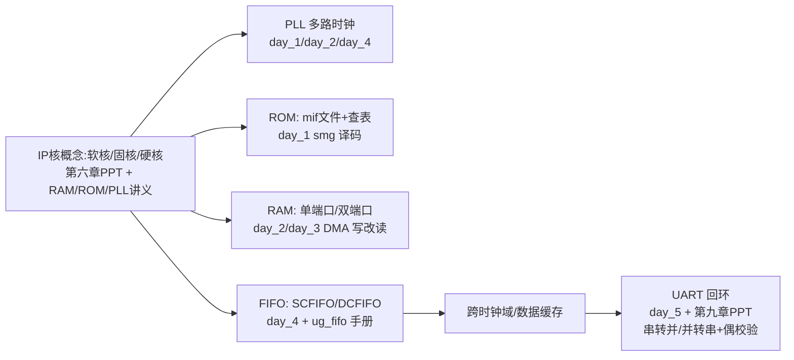

# week5_8.10 周总结 & z_pdf 新增资料汇总

> 生成日期：2026-08-15
> 覆盖范围：本周实验 `week5_8.10/`（day_1 ~ day_6）+ `z_pdf/` 本周新增资料（8/11 ~ 8/14）

---

## 一、本周实验内容 week5_8.10

本周主题是 **「基本 IP 核应用」**：从 PLL 多路时钟、ROM/RAM 存储，到 DMA 数据管理、FIFO 跨时钟域缓冲，再到 UART 串口通信，层层递进，大量使用 Quartus IP 核（ALTPLL / RAM / ROM / FIFO）。

### day_1：PLL + ROM —— 按键切换时钟，数码管观察计数快慢

| 文件 | 模块 | 功能 |
|------|------|------|
| `src/top.v` | top | 顶层：例化 PLL（`clock`，输出 c0~c4 五路时钟）、按键消抖 `key`×2、数码管 `smg`；按键控制 3bit `cnt` 循环切换，组合 MUX 选出一路时钟 `clk_rg` |
| `src/key.v` | key | 按键消抖：两级同步打拍 + 约 20ms 计数确认，输出单脉冲 `flag` |
| `src/smg.v` | smg | 数码管：按 `TIME` 周期循环计数 0~9，经 ROM IP（`rom_data`）查表 → 共阴段码译码输出 `dig` |

- **核心**：数码管计数快慢随 `clk_rg` 频率变化，直观理解"时钟频率对电路行为的影响"。
- **用到的 IP**：PLL（clock）、ROM（rom_data，查表用）。

### day_2：异步双端口 RAM —— 写侧主时钟、读侧可变时钟

| 文件 | 模块 | 功能 |
| ------ | ------ | ------ |
| `src/top.v` | top | 例化 PLL、`key`×2、异步双端口 RAM IP（`ram_data_2`）、`smg`；`data_num` 按主时钟 clk 写入预置数据（2/4/6/8/10/12/14/7/9/5），`rd_addr` 按 `clk_rg` 循环读出并显示 |
| `src/smg_watch.v` | smg_watch | 独立"数据表/秒表"演示：单时钟 RAM IP（`ram_data2`）写满 10 组数据后停写（`data_num` 到 10 关 `wr_en`），读侧循环显示 |
| `src/test_watch.v` | test_watch | 测试 `smg_watch` 的 testbench（`TIME` 调小为 24 缩短仿真） |

- **核心**：演示"读写时钟不同步、读时钟可切换"的异步 RAM 典型应用。
- **用到的 IP**：PLL、异步双端口 RAM（`ram_data_2`）、单时钟 RAM（`ram_data2`）。

### day_3：DMA 数据管理 —— 单/双端口 RAM 的「写 → 改 → 读」

顶层结构：PLL + 5 个按键消抖（`key_0_u~key_4_u`）+ `smg` + RAM 控制器 `dma`。

| 文件 | 说明 |
| ------ | ------ |
| `src/dma.v` | 单端口 RAM（`ram_data_1` IP）。三态主状态机 `WR_S`（自动写 0~9 初始数据）→ `GAI_S`（每按 key2 全部地址 +1）→ `RE_S`（按 `TIME` 扫描读出显示）；改状态含子状态机 `GAI_IDLE→GAI_RD→GAI_SAVE→GAI_WR`（读拍存旧值 → 写拍写回 旧值+1），避开"写时读"干扰；写满 9 个地址后停写 |
| `src/dma_0.v` | 双端口 RAM（`ram_data_2` IP，`inclock/outclock` 均接 clk），读写口分离，改状态多一拍 `GAI_WAIT` 等读口 `q` 稳定 |
| `src/dma_1.v` | 单端口 RAM 简化版：仅 `WR_S/RE_S` 两态，无"改"功能 |
| `src/dma_2.v` | 双端口 RAM：写状态写一组数据，改状态（key[0] 进入）再写另一组（1,3,5,…,15,8,10），读侧用 PLL 可变时钟扫描，演示跨时钟读写 |

- **关键设计点**：写满停写避免同地址读写冲突；改状态用"读拍保存旧值→写拍写回 +1"规避同口读写干扰；读扫描按 `TIME` 分频循环。
- **仿真**：`sim/dma_tb.v`、`dma_single_tb.v`（dma 单独仿真）、`test.v`、`test_top_user.v`（模拟真实按键）。
- **IP**：`clock`（PLL 5 路）、`ram_data_1`（单端口）、`ram_data_2`（双端口）。

### day_4：FIFO + PLL —— 异步 FIFO 读写演示（工程已配好 IP）

> ⚠️ `doc/内容总结.md` 尚未更新（写"src 为空"），实际 `src/top.v` 已存在。

- **`src/top.v`**：FIFO IP（`fifo_data`，异步双时钟 DCFIFO，写 8 位 / 读 16 位，深度 256）+ PLL（`clock`，c0=25MHz … c4=200MHz）。
  - 写侧：主时钟 `clk`，计数器 `cnt` 0~1023 循环，前 500 个周期 `wrreq=1` 且 `data` 递增（模拟写满过程）；
  - 读侧：PLL 25MHz `c0_25`，`cnt>500` 后 `rdreq=1` 开始读取；
  - 引出握手/状态信号：`rdempty/rdfull/wrempty/wrfull`、`wrusedw/rdusedw`。
- **同步 FIFO 示例**：`fifo_data_t`（单时钟，含 `almost_empty/almost_full/empty/full/usedw`）在代码中以注释形式保留，可切换验证。
- **IP 目录**：`prj/ip/fifo/fifo_data.qip`（异步）、`fifo_data_t.qip`（同步）、`prj/ip/pll/clock.qip`。
- **仿真**：`sim/test.v`。

### day_5：UART 回环通信（带偶校验）

> ⚠️ `doc/内容总结.md` 尚未更新（写"src 为空"），实际已有完整 UART 源码。

| 文件 | 模块 | 功能 |
| ------ | ------ | ------ |
| `src/brg.v` | brg | 波特率发生器：`COUNT_MAX = CLK_FREQ/BAUD_RATE - 1`（50MHz/9600 = 5207），计数满输出 `tick` 位脉冲 |
| `src/rx.v` | rx | UART 接收器：两级打拍 + 下降沿检测起始位；状态机 `IDLE→START→RECX→PARITY→STOP`；中间点采样（`rx_mid`），串转并 8bit，输出 `rx_done`、`parity_error`（偶校验）、`data` |
| `src/tx.v` | tx | UART 发送器：状态机 `IDLE→START→DATA→STOP`，按帧格式（起始位 0 + 8bit LSB 先 + 停止位 1）串行发送 |
| `src/dt_smg.v` | dt_smg | 数码管动态扫描显示（接收数据 `rx_data`） |
| `src/top_uart.v` | top_uart | 顶层：例化 `brg_u`/`rx_u`/`dt_smg_u`，`CLK_FREQ=50MHz`、`BAUD_RATE=9600`；`parity_error` 接到 LED |

- **仿真**：`sim/parity_test.v` + `parity_result.txt` —— 专门验证 **偶校验** 逻辑（发送帧：起始位 0 + 8 数据(LSB 先) + 偶校验位 + 停止位 1；`par_correct` 控制校验位是否取反），对应第九章 PPT 的课后作业。
- **工程**：`prj/day_5.qsf` 已加入 `top_uart.v / dt_smg.v / brg.v / rx.v`。

### day_6：暂无内容（仅保留目录结构）

---

## 二、z_pdf 本周新增资料总结（8/11 ~ 8/14）

按时间顺序（8/11 → 8/14）本周新增了 7 份资料，正好与实验内容互补。

### 1. `7.IP核之RAM.pdf`（8/11，32 页）—— IP 核 & RAM 专题

- **IP 核概述**（三份讲义共用前 5 页）：
  - 背景：芯片复杂度年增 55%、设计能力仅提升 21%，厂商把 PLL/FIFO/滤波器等做成可配置标准化模块（IP），类似 C/Python 的函数库；
  - 交付形式三类：**软核**（HDL 源码，如 Nios II/MicroBlaze）、**固核**（综合后网表，如 FFT、AXI/Avalon 总线）、**硬核**（布局布线版图，如 PLL、Block RAM、ARM 核）；
  - 三大弊端：平台不兼容、内部不透明、商用收费高。
- **RAM 分类**：按存储原理分 SRAM/DRAM；按接口技术分 SDRAM、DDR/DDR2/3/4/5。
- **RAM vs ROM**：RAM 可写可读、易失；FPGA 内 ROM 实际也用内部 RAM 资源，只是只用读端口。
- **三种 RAM IP**：
  - 单端口 RAM：读写共用一组地址线，不能同时读写；
  - 简单双端口 RAM：读写地址独立，写口只能写、读口只能读；
  - 真双端口 RAM：两组地址均可读写。
- **配置要点**：数据位宽 / 容量（如 8bit × 256）、时钟模式（单/双时钟）、是否寄存输出（去掉则省一拍延迟）、`aclr/rden` 使能、**Read During Write**（Don't Care / New Data / Old Data，默认 New Data）。

### 2. `7.IP核之ROM.pdf`（8/12，27 页）—— ROM & mif 文件专题

- **存储器简介**：除 RAM 外补充 ROM 家族（ROM/PROM/EPROM/EEPROM）。
- **ROM IP 特点**：FPGA 内 ROM 掉电内容丢失，靠 `.mif`（或 `.hex`）数据文件在上电时初始化；内容必须在数据文件中写死、无法在电路中修改。
- **mif 文件制作**：`File→New→Memory Initialization File` → 设容量/位宽 → 右键 `Custom Fill Cells` 填起始/截止地址与递增数据 → 保存。
- **单端口 ROM**：一个读地址 + 一个读数据端口；配置与 RAM 类似（位宽、容量、单/双时钟、是否寄存输出、加载 mif）。
- **双端口 ROM**：两组读地址/读数据端口（相当于两个单口 ROM），支持每端口独立时钟/读使能/复位。

### 3. `7.IP核之PLL.pdf`（8/12，20 页）—— PLL 专题

- **PLL 概念**：锁相环，可倍频、分频、调相位与占空比；即便不改时钟也常用来降低抖动。
- **ALTPLL 配置五类界面**：
  1. 参数（Parameters）：输入时钟改 50MHz、PLL 类型、输出模式（普通 / In zero delay buffer mode）；
  2. 重配置（Reconfiguration）：扩展频谱、带宽可编程、时钟切换、动态重配置——均保持默认；
  3. 输出时钟（Output Clocks）：最多 c0~c4 五路，可直接填目标频率或设倍/分频系数，可调相移与占空比；
  4. EDA、5. 汇总（Summary）：勾选 `clock_inst.v` 实例模板。
- **端口**：`areset`（异步复位）、`locked`（锁定检测）、`inclk0`、`c0~c4`。
- **应用**：直接改 `clock_inst.v` 实例模板调用。

### 4. `ug_fifo-683522-826815.pdf` + `_翻译.pdf`（8/13，36 页）—— Intel FIFO IP 官方用户指南（中英双语，随手翻翻即可）

- **FIFO 种类**：SCFIFO（单时钟）、DCFIFO（双时钟，读写同宽）、DCFIFO_MIXED_WIDTHS（双时钟，读写不同宽）。
- **常用端口**：`data/wrreq/rdreq/q`、`wrclk/rdclk`、满/空标志（`wrfull/rdempty` 等）、`wrusedw/rdusedw`、`aclr/sclr`。
  - ⚠️ 关键提醒：写请求参考 **wrfull**、读请求参考 **rdempty**（rdfull/wrempty 可能是对侧延迟版）。
- **常用参数**：`lpm_width/lpm_numwords`（宽度/深度 ≥4）、`lpm_showahead`（预示模式）、溢出/下溢保护（默认 ON，满/空自动屏蔽请求）、`*_delaypipe`（跨时钟同步级数，防亚稳态）。
- **要点**：wrfull/rdempty 置位当拍须取消 wrreq/rdreq；DCFIFO 跨时钟标志有 1~3 拍延迟；SCFIFO 支持 `sclr/aclr`，DCFIFO 仅 `aclr`（建议与复位同步）。

### 5. `第六章 基本IP核讲解.pptx`（8/14，33 页）—— 课程讲义：IP 核分类 + PLL/RAM/FIFO

- **课程目标**：了解 PLL/RAM/FIFO 原理、结构、用法与配置步骤，并**仿真**三者。
- **IP 核分类**：软核（RTL 模型，最广泛）、硬核（验证版图，不可改）、固核（带布局规划的网表，主流之一）。
- **PLL**：Cyclone IV 有 2 个 PLL、每个 5 路输出；输入只能是 PLL 所在 Bank 时钟管脚或其他 PLL 输出，内部信号不能驱动 PLL。仿真示例：clk_out0 二分频、out1 相位 270°、out2 二倍频、out3 三倍频、out4 四倍频。
- **RAM**：Cyclone IV 嵌入式 M9K 模块可配成 RAM/移位寄存器/ROM/FIFO；单端口（一组地址）vs 双端口（两组地址）；简单双口（读写地址独立）vs 真双口（两组均可读写）。
- **FIFO**：先进先出，无外部地址线，适合数据缓存与跨时钟域；SCFIFO 用于同步缓存，DCFIFO 用于异步跨时钟域；宽度=单次读写位数、深度=可存字数；空/满标志与 usedw 概念。
- **作业**：练习并熟悉 PLL、RAM、FIFO 三个 IP 核的配置与使用。

### 6. `第九章 串行接口--UART回环设计.pptx`（8/14，26 页）—— 课程讲义：UART 串口通信

- **串行通信基础**：
  - 并行 vs 串行；同步（带时钟线）vs 异步（各自时钟）；
  - 传输方向：单工 / 半双工 / 全双工；
  - 常见接口：UART（异步、全双工）、1-wire（异步、半双工）、SPI（同步、全双工）、IIC（同步、半双工）。
- **UART 协议层**：一帧 = 起始位(1bit) + 数据位(5/6/7/8bit) + 奇偶校验位(1bit) + 停止位(1/1.5/2bit)；波特率（每秒码元数，如 9600/115200）与比特率（bps）；50MHz 下 115200 波特率每 bit 需计数 434 次。
- **UART 物理层**：TTL 电平（3.3V）vs RS232 电平；电气标准 RS-232-C / RS-422 / RS485。
- **需求与设计**：FPGA 与上位机串口通信做**数据回环**，波特率可调，**用 FIFO 做数据缓存**；模块划分 = UART 接收（串转并）+ 控制（读写 FIFO）+ UART 发送（并转串）。
- **时序设计**：接收侧用下降沿启动计数器、中间点采样、串转并 10bit 后取 8bit；发送侧用 `tx_vld` 启动、按帧格式 LSB 先发送，`tx_rdy` 表示可发送下一个。
- **作业**：① 巩固 UART 协议与时序；② 在回环基础上**加奇偶校验位**实现带校验的串口回环（本实验 day_5 已实现偶校验版）。

---

## 三、本周知识脉络（实验 ↔ 资料对照）

- **知识主线**：`IP 核是什么（软/固/硬核）` → `PLL 时钟生成` → `ROM/RAM 存储与查表` → `FIFO 跨时钟域缓冲` → `UART 串口通信回环`，每一步都是"讲义原理 + 实验验证"的闭环。
- **day_4 对应 ug_fifo 手册**：实验里的 `fifo_data` 即 DCFIFO（异步双时钟），用到了 `wrusedw/rdusedw`、空满标志与"先写满再读"的时序要求。
- **day_5 对应第九章 PPT**：`brg/rx/tx` 完整实现帧格式（起始位+数据+停止位），`parity_test.v` 实现作业要求的**偶校验**扩展。
- **后续可做**：UART + FIFO 回环完整工程（第九章 PPT 需求：串口接收→FIFO 缓存→串口发送）。

---

## 四、备注

- `z_pdf/_extract/` 下新增了 `extract_new.py`（提取 PDF）、`extract_pptx.py`（标准库提取 PPTX）与 `txt_new/` 文本，方便日后检索讲义内容；不需要可删除。
- day_4 / day_5 的 `doc/内容总结.md` 尚未更新（仍写"src 为空"），本次总结已按实际源码补齐。
